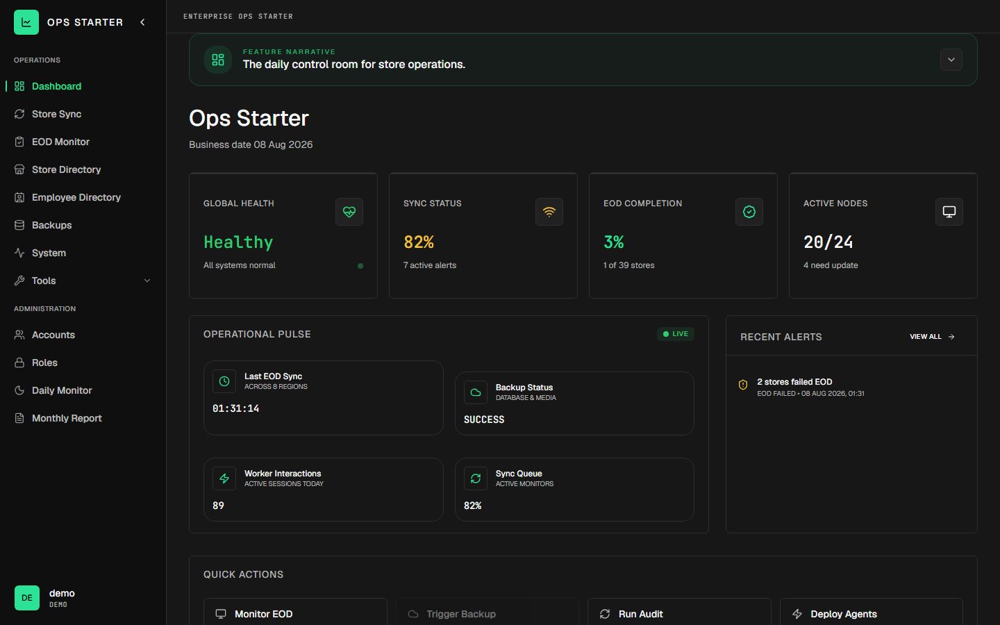
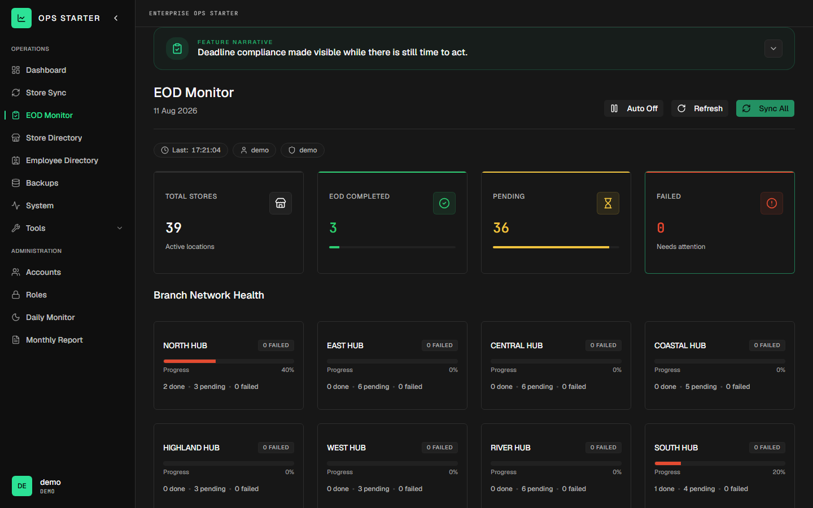
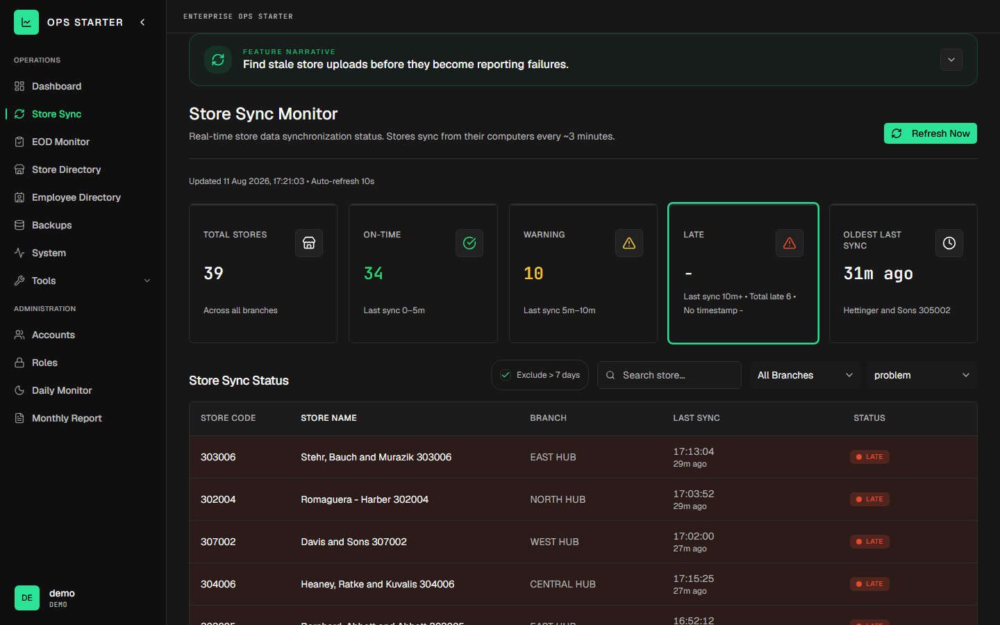
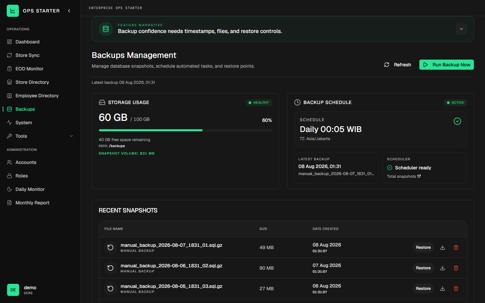
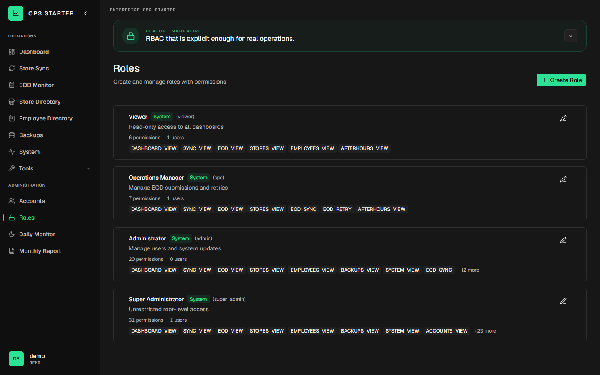
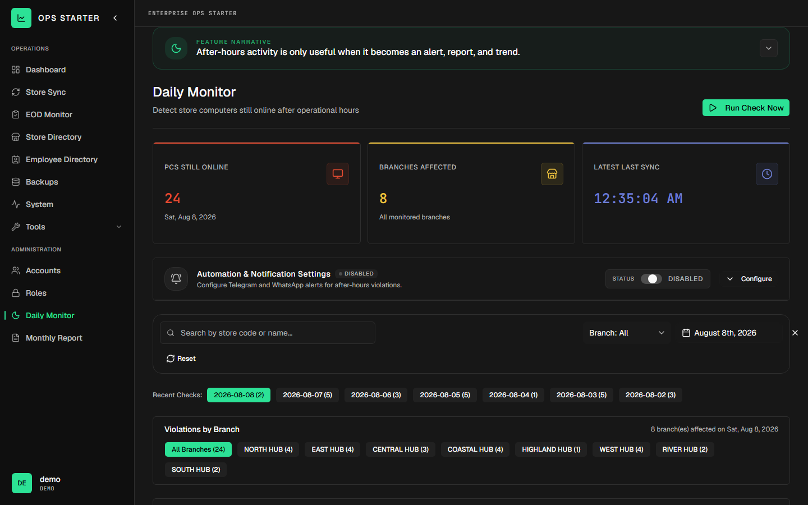

# Enterprise Ops Monitor

 

Real-time visibility for End-of-Day operations, store sync health, backups, agents, access control, and after-hours activity across a simulated retail branch network.



> **Demo Disclosure**
>
> This repository is a **portfolio demo**. Every metric, store, employee, user, credential, log line, and system reading you see is **simulated or anonymized** — generated at runtime by the mock API with faker data. No real store, employee, customer, credential, message-provider, or operational data is included. The only account is the demo account (`demo` / `demo123`), and all sessions live in memory (a restart resets everything). A real full-stack codebase (Express + Sequelize + PostgreSQL) is kept in the repo as **reference material only** — it is never built or deployed by the default path.

## Why this project exists

Built on operational experience from a retail-IT internship: nightly End-of-Day uploads, store sync health, backup confidence, and branch-scoped access were daily realities. The internal system behind that work is confidential and cannot be shown, so this app is a from-scratch rebuild — the same operational domain, on a modern stack, with 100% simulated data. No original code, employer technology, or real records are reused.

_Original code, modern stack, simulated data — nothing from the internal system it models._

---

## Quickstart (2 commands, zero configuration)

```bash
docker compose up -d --build
```

Open **http://localhost:5173** and log in with:

| Username | Password  |
| -------- | --------- |
| `demo`   | `demo123` |

There is a one-click **Demo Account** quick-login button on the login screen that types the credentials for you.

No `.env`, no database, no secrets, no setup: the default compose file boots exactly two containers — the web app (nginx SPA) and the mock API (faker dummy data). The mock API joins the demo network under the alias `api`, so the nginx `/api` reverse proxy works unchanged.

## Local development (no Docker needed)

Two terminals:

```bash
# Terminal 1 — mock API on http://localhost:4000 (faker dummy data)
pnpm dev:mock

# Terminal 2 — Vite dev server on http://localhost:5173, pointed at the mock API
VITE_API_URL=http://localhost:4000 pnpm dev
```

Windows PowerShell: `$env:VITE_API_URL="http://localhost:4000"; pnpm dev`

## Feature highlights

- **Dashboard** — one scan-friendly control room: KPI cards, EOD completion, recent alerts, and operational shortcuts.
- **Store Sync** — find stale store uploads before they become reporting failures (10-second UI refresh, 8 branches modeled).
- **EOD Monitor** — deadline compliance made visible: per-store status by date and branch, retry actions, XLSX exports (EOD starts 19:30 WIB).
- **Store & Employee Directories** — searchable, filterable, paginated records with Excel exports.
- **Backups** — schedule, snapshots, downloads, and guarded restore actions (daily 00:05).
- **System Health** — service cards, health checks, guarded restarts, log browsing and export.
- **Agent Updater & Office Agent Monitor** — rollout status, version drift, laptop heartbeat health.
- **Accounts, Roles, After Hours** — branch-scoped RBAC with 30+ permissions, permission overrides, and after-hours violation monitoring with monthly reports.

The full catalog — **18 documented feature surfaces** (17 story cards plus the Login screen) across 24 routed page components of 25 in `apps/web/src/pages/` (the one unrouted directory, `Billing/`, is a refactor remnant) — with problem/solution/impact narratives, routes, and metrics — lives in [docs/portfolio.md](docs/portfolio.md).

## Screenshots

Real captures from a live run of the demo (`pnpm dev:mock` + dev server, 1440x900), taken by `pnpm screenshots`.

| Dashboard                                    | EOD Monitor                              | Store Sync                                     |
| -------------------------------------------- | ---------------------------------------- | ---------------------------------------------- |
|  |  |  |
| KPI cards, health, alerts, quick actions     | Per-store deadline compliance matrix     | Stale-upload radar with live refresh           |

| Backups                                  | Roles                                | After Hours                                     |
| ---------------------------------------- | ------------------------------------ | ----------------------------------------------- |
|  |  |  |
| Snapshot schedule & restore              | RBAC permission editor               | Late-PC violation monitoring                    |

Full walkthrough GIF + all surfaces: [docs/portfolio.md](docs/portfolio.md) · Re-capture anytime with `pnpm screenshots`. Walkthrough GIF: [docs/screenshots/walkthrough.gif](docs/screenshots/walkthrough.gif).

## Skills demonstrated

- **React 19 + Vite + TypeScript SPA** — route-level RBAC gating via a `PrivateRoute` wrapper with typed `Permissions` checks on every protected route.
- **shadcn/ui + Tailwind design system** — 40+ composable components in `apps/web/src/components/ui/` styled with CSS-variable design tokens in `src/index.css`.
- **REST API design** — Express mock API with 99 endpoints, a consistent `{ ok, data, meta, error }` envelope, and a typed API client per domain in `src/lib/api/`.
- **Deterministic demo data** — faker seeded from a fixed `DEMO_SEED` (mulberry32 RNG), so two boots produce identical data for the same seed.
- **Automated testing** — Playwright end-to-end suite across desktop and mobile viewports plus vitest unit tests, all wired into GitHub Actions CI.
- **Zero-config deployment** — two-container Docker Compose demo (web + mock API, no database, no `.env`) with `scripts/` deploy and health-check automation.

## Tech stack

| Layer              | DEMO RUNTIME (the deployed default)                                                         | REAL STACK (kept in repo as reference, never deployed)                                                                                                 |
| ------------------ | ------------------------------------------------------------------------------------------- | ------------------------------------------------------------------------------------------------------------------------------------------------------ |
| Frontend           | React 19, Vite 7, TypeScript, Tailwind CSS, shadcn/ui, React Router 7                       | Same `apps/web` codebase                                                                                                                               |
| API                | `mock-api`: Node.js, Express 5, @faker-js/faker, exceljs — 99 endpoints, in-memory sessions | `apps/api`: Express 5, Sequelize 6, Zod, JWT auth, bcrypt, RBAC v2 with branch scoping, passport (local + Google OAuth), schedulers, automated backups |
| Database           | None (in-memory faker data, WIB timezone)                                                   | PostgreSQL 15 with Row-Level Security, forward-only migrations                                                                                         |
| Proxy / Web server | nginx (SPA routing + `/api` → `api:3000`)                                                   | Same nginx, plus `/agent_updates` static mount                                                                                                         |
| Deployment         | `docker-compose.yml`: `web` + `mock-api` only, health checks, zero config                   | `docker-compose.full.yml`: `web` + `api` + PostgreSQL + autoheal — **reference only**                                                                  |

## Repository layout

```
enterprise-ops-monitor/
├── apps/
│   ├── web/          # React + Vite + TS + Tailwind + shadcn SPA (demo frontend)
│   │   ├── src/pages/      # one folder per feature surface
│   │   ├── src/lib/api/    # typed API clients (axios, { ok, data, meta, error } envelope)
│   │   ├── e2e/            # Playwright demo test suite
│   │   └── nginx.conf      # SPA + /api reverse proxy
│   └── api/          # Express + Sequelize + PostgreSQL full stack — REFERENCE ONLY
├── mock-api/         # tiny Express + faker demo server (the demo backend)
├── packages/shared/  # @eom/shared TypeScript package
├── scripts/          # deploy.js, deploy-check.js, deploy-ops.sh, start-web-e2e.mjs
├── docs/             # prd, architecture, portfolio, security, development, research, adr
├── docker-compose.yml      # DEFAULT: light demo (web + mock-api)
├── docker-compose.full.yml # REAL FULL STACK — reference only, never deployed
├── AGENTS.md         # AI-agent contract (commands, conventions, verification)
└── TODO.md           # historical: the finished demo-first conversion (active roadmap: docs/roadmap.md)
```

## Deployment

The default and only recommended deploy path is the **light demo** — two containers, no database, no secrets:

```bash
bash scripts/deploy-ops.sh --host <ssh-target> --mode demo
```

`--mode demo` is the default; the script runs a local preflight (`pnpm check:all`, clean worktree, origin check), a remote preflight (deps, compose config validation), then deploys and verifies health with `node scripts/deploy-check.js --demo`.

The real full stack (`docker-compose.full.yml`: web + Express API + PostgreSQL + autoheal) is **reference only** and never deployed for the demo — deploying it requires `DB_PASS` and `JWT_SECRET`. See [docs/architecture.md](docs/architecture.md) and [docs/adr/0001-portfolio-demo-first.md](docs/adr/0001-portfolio-demo-first.md) for the rationale.

## Documentation

| Document                                                                       | Purpose                                                               |
| ------------------------------------------------------------------------------ | --------------------------------------------------------------------- |
| [docs/prd.md](docs/prd.md)                                                     | Product brief for the portfolio demo-first conversion                 |
| [docs/architecture.md](docs/architecture.md)                                   | Both architectures: deployed demo runtime and reference full stack    |
| [docs/portfolio.md](docs/portfolio.md)                                         | The portfolio story: 18 documented feature surfaces, routes, metrics  |
| [docs/roadmap.md](docs/roadmap.md)                                             | The active execution roadmap (supersedes `TODO.md`)                   |
| [docs/security.md](docs/security.md)                                           | Demo security boundaries + reference summary of completed remediation |
| [docs/development.md](docs/development.md)                                     | Run, extend, test, and deploy guide (human + agent)                   |
| [docs/research.md](docs/research.md)                                           | Research log: build-speed audit, security audit, demo-first rationale |
| [docs/adr/0001-portfolio-demo-first.md](docs/adr/0001-portfolio-demo-first.md) | Architecture decision record: demo-first, real stack as reference     |
| [AGENTS.md](AGENTS.md)                                                         | The AI-agent contract: commands, conventions, verification workflow   |

## License

Released under the [MIT License](LICENSE).
